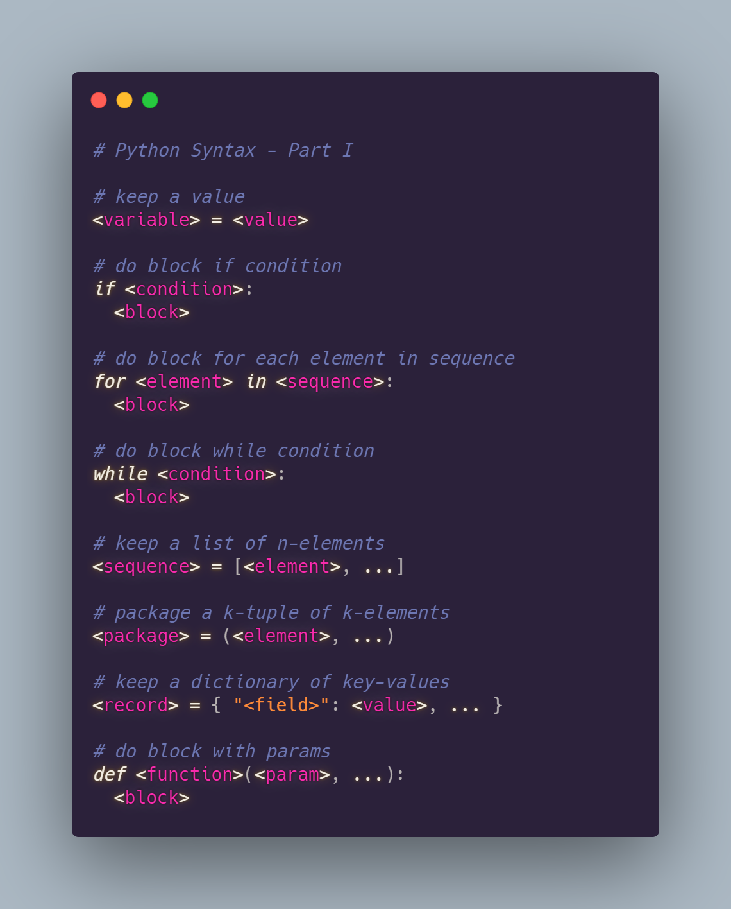

# Curso de Python Intel

Por [Alan Badillo Salas (Dragón Nómada)](mailto://dragonnomada123@gmail.com)

Correo: [dragonnomada123@gmail.com](mailto://dragonnomada123@gmail.com)

## Noticias

* **Martes 28 de Septiembre de 2021** - Ya está disponible la [Serie 5](./ejercicios/serie-5.md) de ejercicios.
* **Lunes 20 de Septiembre de 2021** - Ya está disponible la [Serie 4](./ejercicios/serie-4.md) de ejercicios.
* **Domingo 12 de Septiembre de 2021** - Ya está disponible la [Serie 3](./ejercicios/serie-3.md) de ejercicios.
* **Miércoles 8 de Septiembre de 2021** - Ya está disponible la [Serie 2](./ejercicios/serie-2.md) de ejercicios.

## IMPORTANTE

```txt
Hola a todos.

El motivo de este correo es notificarles que el día viernes 22 de octubre será el cierre del curso.

Para poder evaluar su desempeño y aprendizaje es necesario que realicen un proyecto que combine de 2 a 5 problemas que puedan ser resueltos con Python de los expuestos en el curso.

Recuerden que todo el material del curso se encuentra disponible en:

https://github.com/dragonnomada/python-intel

Las notas del curso sobre todos los temas expuestos se encuentran directamente en:

https://github.com/dragonnomada/python-intel/tree/main/notas

Y los problemas que pueden ser resueltos con Python se encuentran directamente en:

https://github.com/dragonnomada/python-intel/blob/main/100_problemas.ipynb

El día de hoy (lunes 18 de octubre de 2021) haremos un repaso general del curso y resolveremos cualquier duda que tengan sobre el contenido del curso (listado más abajo). Si hay necesidad de volver a ver algún tema desde el principio lo haremos, por lo que es importante que asistan, ya que esta será la última sesión de repaso/aprendizaje del curso.

El día viernes (22 de octubre de 2021) se dará por concluído el curso y la dinámica de la clase será la siguiente:

1. Se eligirá a un alumno para exponer su proyecto.
2. El alumno deberá compartir su pantalla y explicar en qué consiste su proyectos.
3. El alumno tendrá 5 min para exponer su proyecto.
4. El alumno deberá justificar porque es importante su proyecto (dar un ejemplo de en qué se utiliza en el ámbito laboral o científico).
5. El alumno deberá explicar brevemente el código e indicar las piezas de código importantes.
6. El alumno deberá ejecutar su proyecto y mostrar los resultados esperados.

Deben ser lo más breve posible y no entrar en detalles.

Ejemplo de la exposición de un proyecto.

[Comparte pantalla]

[Se presenta]
Hola, soy Alan Badillo y este es mi proyecto

[Muestra el código]
Mi proyecto consiste en un "Descargador de Imágenes Automatizado mediante un archivo CSV". 

[Justifica su proyecto]
Actualmente el aprendizaje automático requiere miles muestras de imágenes para aprender a reconocer objetos y acciones que ocurren dentro de estas imágenes, como que hay una persona parada tocando guitarra, o hay un perro sonriendo. Poder automatizar la descarga de imágenes manualmente etiquetadas constituye un gran avance en este campo.

[Descripción del código]
El programa abre un archivo llamado "imagenes.csv" mediante la librería pandas.

Cada registro del dataframe contiene una columna de Etiquetas y otra con la URL.

En un iterador FOR se recorre cada registro, se descarga la imagen y se guarda en la carpeta llamada igual que la etiqueta con un nombre aleatorio.

[Ejecuta el programa]
Aquí podemos ver cómo va descargando cada imagen y guardándola. Cuándo termina muestra un mensaje y podemos observar que ya están nuestras imágenes en cada carpeta correspondiente.

[Se despide]
Gracias a todos.

Se recomienda que hagan un guión similar para optimizar su tiempo de exposición, si lo desean pueden usar diapositivas, pero el programa tiene que ser ejecutado en tiempo real.

El proyecto deberán mandarlo antes del día 22 de octubre de 2021 a las 7:59 horas CDMX. En un archivo ZIP deben colocar sus códigos y si gustan también sus presentaciones y resultados.

No es necesario documentar el código, pero si poner su nombre completo, la descripción y justificación.

El proyecto será considerado cómo la forma de evaluación para medir el desempeño en el curso, por lo que es importante que elijan problemas sencillos que puedan finalizar al día viernes. No pueden presentar algo incompleto.

Algunas ideas de proyectos son:

1. Automatizar la descarga de imágenes con un archivo de texto.
2. Automatizar la descarga de imágenes con un archivo de CSV.
3. Automatizar la descarga de imágenes con un archivo de Excel.
4. Automatizar la descarga de imágenes con una consulta a MySQL.
5. Automatizar la descarga de imágenes con una consulta a MongoDB.

7. Automatizar un reporte de ventas GRÁFICO desde un archivo de texto.
8. Automatizar un reporte de ventas GRÁFICO desde un archivo de CSV.
9. Automatizar un reporte de ventas GRÁFICO desde un archivo de Excel.
10. Automatizar un reporte de ventas GRÁFICO desde un archivo de MySQL.
11. Automatizar un reporte de ventas GRÁFICO desde un archivo de MongoDB.

12. Generar un reporte de ventas PDF desde un archivo de texto.
13. Generar un reporte de ventas PDF desde un archivo de CSV.
14. Generar un reporte de ventas PDF desde un archivo de Excel.
15. Generar un reporte de ventas PDF desde un archivo de MySQL.
16. Generar un reporte de ventas PDF desde un archivo de MongoDB.

17. Mostrar las lecturas de un sensor en API desde un archivo de texto.
18. Mostrar las lecturas de un sensor en API desde un archivo de CSV.
19. Mostrar las lecturas de un sensor en API desde un archivo de Excel.
20. Mostrar las lecturas de un sensor en API desde un archivo de MySQL.
21. Mostrar las lecturas de un sensor en API desde un archivo de MongoDB.

22. Enviar a imprimir al sistema operativo un reporte generado en TEXTO.
23. Enviar a imprimir al sistema operativo un reporte generado en GRÁFICO.
24. Enviar a imprimir al sistema operativo un reporte generado en PDF.

Si el día viernes no pueden asistir a la clase deberán notificarlo a dragonnomada123@gmail.com anexando su proyecto comprimido en ZIP y el video de duración de 5 min máximo presentando sus videos. Se debe ver la ejecución de su proyecto en tiempo real.

Pueden usar replit.com, kaggle.com o su computadora para ejecutar su proyecto.

Se recomienda una notebook de jupyter para ir ejecutando parte por parte de su proyecto, pero no es obligatorio.

Quién no presente proyecto será notificado al monitor para que él determine una forma alternativa de evaluación, por ejemplo un examen. Y así poder obtener su certificado de aprobación.

No se tomarán en cuenta las faltas, por lo que bastará la exposición de su proyecto final para demostrar lo aprendido.

En el caso de los proyectos que no estén bien justificados o no haya una buena explicación del código (es decir, que el alumno no demuestre entender absolutamente nada de su proyecto), entonces se determinarán esos casos especiales con el monitor.

Se recalca la recomendación de no hacer proyectos ambiciosos y limitarse a lo aprendido en el curso. La evaluación está centrada en el temario del curso.
* Módulo 1. Introducción a Python
¿Qué es Programación?
Escribir Código Fuente
Ejecutar Código Fuente
¿Por qué Python?
Instalando

* Módulo 2. Fundamentos de programación con Python
Variables
Tipos de Datos
Practicando los Tipos de Datos

* Módulo 3. Funciones, Números y Operadores
Funciones
Funciones con Parámetros y argumentos
Funciones que Retornan Valores
Diferencias entre Funciones y Métodos
Números y ejemplos con números
Funciones con Números

* Módulo 4. Arreglos e iteradores
Qué son los Arreglos (Arrays) en Programación
Trabajando con Lists en Python Veamos que son los iteradores 
Si en la última sesión del lunes 18 de octubre de 2021 no expresan alguna duda sobre los temas, se supondrá que quedaron completamente entendidos a lo largo del curso y que el temario fue completado exitosamente. Es deber del alumno usar esta última sesión para aclarar sus dudas respecto al temario del curso.

Sin más, agradezco a todos su participación y energía destinada los últimos meses para el desarrollo y conclusión de este curso. Les deseo mucho éxito en sus proyectos y en su trayectoria profesional en general.
```

## Contenido

```text
> Módulo 1. Introducción a Python
¿Qué es Programación?
Escribir Código Fuente
Ejecutar Código Fuente
¿Por qué Python?
Instalando

> Módulo 2. Fundamentos de programación con Python
Variables
Tipos de Datos
Practicando los Tipos de Datos

> Módulo 3. Funciones, Números y Operadores
Funciones
Funciones con Parámetros y argumentos
Funciones que Retornan Valores
Diferencias entre Funciones y Métodos
Números y ejemplos con números
Funciones con Números

> Módulo 4. Arreglos e iteradores
Qué son los Arreglos (Arrays) en Programación
Trabajando con Lists en Python
Veamos que son los iteradores
```

## Sintaxis

> Parte 1 - Variables, Condicionales, Iteradores, Ciclos Condicionales y Funciones



> Parte 2 - Importación y Clases


## ¿Cómo clonar este repositorio?

> 1. Instalar Git para Windows (en Linux y Mac ya viene instalado)

[https://git-scm.com/download/win](https://git-scm.com/download/win)

> 2. En la terminal, ubicar la carpeta dónde se va a clonar

```bash
cd ~/Desktop
```

> 3. Clonar el repositorio

```bash
git clone https://github.com/dragonnomada/python-intel.git
```

> 4. Ir a la carpeta clonada (`python-intel`)

```bash
cd ~/Desktop/python-intel

--- terminal windows ---
dir

--- terminal windows / salida ---

Directorio: E:\santuario\cursos\python-intel


Mode                 LastWriteTime         Length Name
----                 -------------         ------ ----
d-----        06/09/2021     20:24                codigos
d-----        06/09/2021     18:31                ejercicios
d-----        06/09/2021     18:43                lab
d-----        06/09/2021     20:23                notas
-a----        06/09/2021     20:54           1950 README.md
```

> 5. Abrir en Visual Code ([https://code.visualstudio.com](https://code.visualstudio.com))

```bash
code .
```

> 6. Para obtener los nuevos cambios

```bash
git pull
```