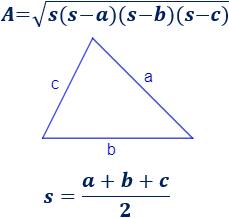

# Ejercicios de Python - Serie III

By [Alan Badillo Salas (Dragón Nómada)](dragonnomada.medium.com)

## Introducción

En esta tercera serie de ejercicios dominaremos el uso de colecciones (listas, tuplas y diccionarios).

## Listas

### S3L1 - Lista de números

Crea una lista con los valores de `[1, 4, 3, 5, 2, 7, 8, 6, 3, 2, 1, 4, 5, 3]` y genera el siguiente reporte.

> Reporte a generar

```txt
# Reporte Estadístico

- Lista: [1, 4, 3, 5, 2, 7, 8, 6, 3, 2, 1, 4, 5, 3]

+-----------------------+
| Estadístico | Valor   |
+ ----------- + ------- +
| Total       | 14      |
| Suma        | 54      |
+ ----------- + ------- +
| Mínimo      | 1       |
| Máximo      | 8       |
+ ----------- + ------- +
| Promedio    | 3.8571  |
+-----------------------+
```

### S3L2 - Reporte estadístico

Crea una función llamada `reporteEstadistico(<numeros>)` que reciba una lista de `<numeros>` e imprima el siguiente reporte.

> Ejemplo del reporte a generar al llamar a `reporteEstadistico([1, 2, 3])`

```txt
# Reporte Estadístico

- Lista: [1, 2, 3]

+-----------------------+
| Estadístico | Valor   |
+ ----------- + ------- +
| Total       | 3       |
| Suma        | 6       |
+ ----------- + ------- +
| Mínimo      | 1       |
| Máximo      | 3       |
+ ----------- + ------- +
| Promedio    | 2.0000  |
+-----------------------+
```

### S3L3 - Reporte de Frutas

Crea una función llamada `reporteFrutas(<frutas>)` que reciba una lista de `<frutas>` (una lista de textos con nombres de frutas) y genere el siguiente reporte.

> Ejemplo del reporte a generar para `reporteFrutas(["manzana", "manzana", "pera", "mango", "mango", "manzana"])`

```txt
# Reporte de Frutas

- Frutas:      ["manzana", "manzana", "pera", "mango", "mango", "manzana"]
- Distintas:   ["manzana", "pera", "mango"]
- Totales:     [3, 1, 2]

+---------------------+
| Fruta       | Total |
+ ----------- + ----- +
| manzana     |   3   |
+ ----------- + ----- +
| pera        |   1   |
+ ----------- + ----- +
| mango       |   2   |
+---------------------+
```

## Tuplas

### S3T1 - Distancia entre puntos

Crea una función llamada `distancia(<punto_1>, <punto_2>)` que reciba el `<punto_1>` y el `<punto_2>` que son `2-tupla` de la forma `(<x>, <y>)`. Devuelve la distancia euclideana entre ambos puntos usando `RAIZ( (X1 - X2)^2 + (Y1-Y2)^2 )`.

> Ejemplo

```py
punto_1 = (1, 1)
punto_2 = (2, 3)

d = distancia(punto_1, punto_2)

print(d) # 2.23606797749979
```

### S3T2 - Puntos cercanos al objetivo

Crea una función llamada `distanciaObjetivo(<punto_objetivo>, <lista_puntos>)` que imprima un reporte de las distancias de cada punto al punto objetivo.

> Ejemplo del reporte a imprimir para `distanciaObjetivo((1, 1), [(0, 0), (1, 1), (1, 2), (2, 1), (2, 2)])`

```txt
# Reporte de Distancias al Objetivo

- Objetivo:    (1, 1)
- Puntos:      [(0, 0), (1, 1), (1, 2), (2, 1), (2, 2)]

+-------------------------+
| Punto       | Distancia |
+ ----------- + --------- +
| (0, 0)      | 1.4142    |
+ ----------- + --------- +
| (1, 1)      | 0.0000    |
+ ----------- + --------- +
| (1, 2)      | 1.0000    |
+ ----------- + --------- +
| (2, 1)      | 1.0000    |
+ ----------- + --------- +
| (2, 2)      | 1.4142    |
+-------------------------+
```

### S3T3 - Área del triángulo

Crea una función llamada `areaTriángulo(punto_1, punto_2, punto_3)` que devuelva el área del triángulo.

> Pista - Cacula la distancia entre los puntos `a`, `b`, `c` y usa la siguiente fórmula



## Diccionarios

### S3D1 - Datos de un producto

Crea una función llamada `capturarProducto()` que solicite los datos de un producto según la siguiente tabla.

Clave | Tipo
--- | ---
sku | `str`
nombre | `str`
descripcion | `str`
precio | `float`
existencias | `int`

> Ejemplo de un producto capturado

```py
producto = capturarProducto()

print(producto)
# {
#     'sku': 'abc123',
#     'nombre': 'Coca Cola',
#     'descripcion': 'Refresco de Cola',
#     'precio': 18.5,
#     'existencias': 10
# }
```

### S3D2 - Extractor de precios

Crea una función llamada `extractorPrecios(<productos>)` que reciba una lista de `<productos>` y devuelva una lista con el precio de cada producto.

> Ejemplo

```py
productos = [
    {
        "sku": "abc123",
        "nombre": "Coca Cola",
        "precio": 18.5,
        "existencias": 10
    },
    {
        "sku": "def456",
        "nombre": "Galletas Marías",
        "precio": 15.5,
        "existencias": 5
    },
    {
        "sku": "ghi",
        "nombre": "Gansito",
        "precio": 8.0,
        "existencias": 4
    }
]

print ( extractorPrecios(productos) ) # [18.5, 15.5, 8.0]
```

> Pista - Recorre cada producto y extra el precio mediante `producto["precio"]`

### S3D3 - Reporte de productos

Crea una función llamada `reporteProductos(<productos>)` que reciba una lista de `<productos>` e imprima un reporte similar al siguiente.

> Ejemplo del reporte para `reporteProductos(productos)`

```txt
# Reporte de Productos

- Total: 3

Productos:
[abc123] Coca Cola        $18.50    x10
[def456] Galletas Marías  $15.50    x5
[ghi789] Gansito          $8.00     x4

Total: $294.50
```

> Pista suma los precios múltiplicados por sus existencias para imprimir el total
